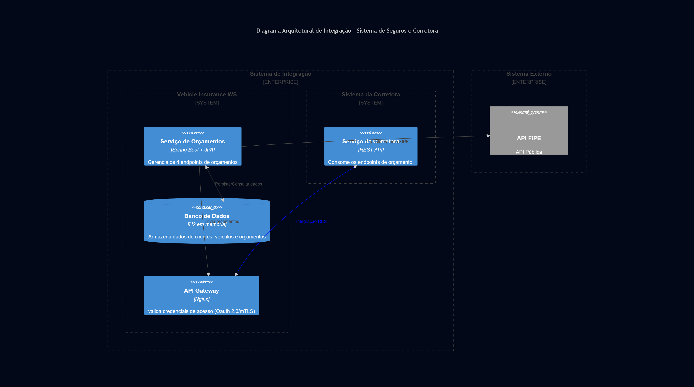
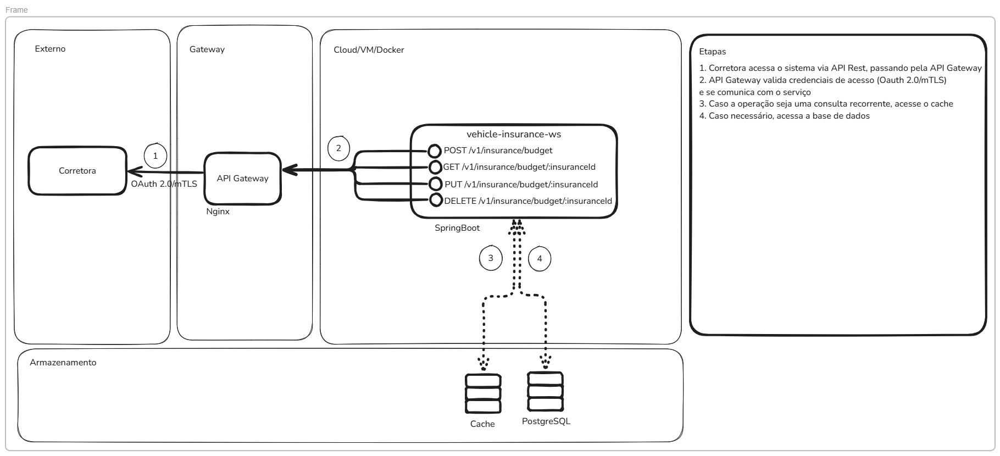
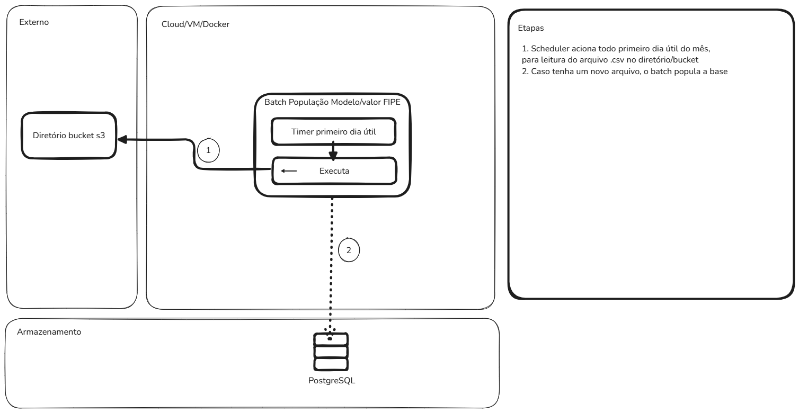

# Vehicle Insurance Web Service

Este repositório faz parte do processo seletivo para desenvolvedor backend da Audsat.
Este projeto implementa uma API REST para gerenciamento de orçamentos de seguros de veículos, permitindo a criação, consulta, atualização e exclusão de orçamentos.

## Tecnologias Utilizadas

- Java 17
- Spring Boot 3.4.4
- Spring Security + JWT Authentication
- Spring Data JPA
- H2 Database
- Maven
- Docker
- Swagger/OpenAPI

## Estrutura do Projeto

O projeto é uma aplicação Spring Boot padrão com as seguintes funcionalidades:

- Autenticação e autorização com JWT
- API RESTful para gerenciamento de orçamentos de seguros
- Documentação da API com Swagger/OpenAPI
- Persistência de dados com H2 Database

## Pré-requisitos

Para execução local:
- JDK 17
- Maven 3.8+

Para execução com Docker:
- Docker
- Docker Compose

## Execução Local com Maven

1. Clone o repositório:
```bash
git clone https://github.com/Gabriel-munizds/vehicle-insurance-ws.git
cd vehicle-insurance-ws
```

2. Compile o projeto e execute os testes:
```bash
./mvnw clean package
```

3. Execute a aplicação:
```bash
./mvnw spring-boot:run
```

A aplicação estará disponível em: http://localhost:8080/insurance

## Execução com Docker

1. Clone o repositório:
```bash
git clone https://github.com/Gabriel-munizds/vehicle-insurance-ws.git
cd vehicle-insurance-ws
```

2. Construa e execute o container Docker:
```bash
docker-compose up --build
```

A aplicação estará disponível em: http://localhost:8080/insurance

Alternativamente, você pode construir e executar manualmente:

```bash
docker build -t vehicle-insurance-ws .
docker run -p 8080:8080 vehicle-insurance-ws
```

## Documentação da API

A documentação da API está disponível através do Swagger UI quando a aplicação está em execução:

http://localhost:8080/swagger-ui.html

## Autenticação e Autorização

A API utiliza autenticação JWT. Para usar os endpoints protegidos:

1. Crie um usuário através do endpoint `/signup`
2. Obtenha um token JWT através do endpoint `/login`
3. Inclua o token JWT nas requisições subsequentes no cabeçalho `Authorization: Bearer <token>`

## Endpoints principais

### Autenticação

- `POST /signup` - Cadastro de novos usuários
- `POST /login` - Obtenção de token JWT

### Orçamentos

- `POST /budget` - Criar novo orçamento
- `GET /budget/{insuranceId}` - Consultar orçamento por ID
- `PUT /budget/{insuranceId}` - Atualizar orçamento existente
- `DELETE /budget/{insuranceId}` - Remover orçamento

## Exemplo de uso da API

### 1. Criar usuário

```bash
curl -X POST "http://localhost:8080/insurance/signup" \
     -H "Content-Type: application/json" \
     -d '{"login":"usuario", "password":"senha"}'
```

### 2. Obter token JWT

```bash
curl -X POST "http://localhost:8080/insurance/login" \
     -H "Content-Type: application/json" \
     -d '{"login":"usuario", "password":"senha"}'
```

### 3. Criar orçamento

```bash
curl -X POST "http://localhost:8080/insurance/budget" \
     -H "Content-Type: application/json" \
     -H "Authorization: Bearer SEU_TOKEN_JWT" \
     -d '{
           "customerName": "Ricardo Luiz Almada",
           "driverDocument": "68416487272",
           "birthdateDriver": "15/03/1993",
           "licensePlate": "AAA1A11",
           "modelCar": "Palio 1.0/ Trofeo 1.0 Fire/ Fire Flex 4p",
           "fipeCodeModelCar": "0011770",
           "manufacturerModelCar": "Fiat",
           "modelYearCar": 2017,
           "fuelType": 1,
           "fipeValueModelCar": 33184,
           "mainDriver": true
         }'
```

## Banco de dados

O projeto utiliza H2 Database, um banco de dados em memória. O console do H2 está disponível em:

http://localhost:8080/h2-console

Configurações de conexão padrão:
- JDBC URL: `jdbc:h2:mem:vehicle-insurance-db`
- Usuário: `root`
- Senha: `root`

### Modelagem do banco de dados

Durante o desenvolvimento do projeto, o banco de dados sofreu alterações em sua modelagem. Segue o modelo atualizado:

[](https://mermaid.live/edit#pako:eNq1VcuO2jAU_ZXIawYxkBCSHQOMhAozFQxdVEiWG1-C1cROHZuWAv9ekzAQSHhs6kVi33N9n8f2BgWCAvIRyD4joSTxnFtm9LqTqbXJ5_sxEjy0GLW-frmQxWZ7ZL0WxFMlmQEiFgBPAScRUZCju_yXf8fv_cHoro-DsQVLAO8jLSEU0kCyRDHBS1hMuF6QQGkJ8gQOuYIQpLXQEGG1TqAMZUnhNZDCthcW9iFgMYnyaFYk0lAMPiBR36T6wWKwIpIqrBNq1vhS-6wK_cnw22DyaBmoCHQMXFW4tX4wqZa0utamm_hBT5ksIBIb-eulnEq2ghL0IkQEhFssxTFhHOdaVWHMph_v48fT5SSGuxGceRi-TWeT7ltv8GCeOlUihopki80MJJA9vzBV11TyVlNM1P1KFspluGnSqeQYidgvLVQlxniqJeHBdVr1Rt3h-H_0-sQ3WBki4iuEm00f73IkQlY-uwlJ099C0us3x3b79CQ2-U3lW0uSFm6uE3bkfUHlU3Rb68xQXs8bNm4qbLcF7hddHIUHMwX-XomkrIFqKJSMIl9JDTVk6GxOoVmirPxzpJZgjhHyzZQS-XOO5nxn9iSEfxci_twmhQ6Xn4uczocH4agBnILsCc0V8ltOZgH5G_QH-U27U2-2XNd59ly70XLaNbRGvufUvWbT9dpuw257nY69q6G_mctG3e3Yz62GgT236TieXUNAmRJynL9G2aO0-wcvqe2w)


## Solução de problemas

### Problemas com portas em uso

Se a porta 8080 já estiver em uso, você pode alterar a porta no arquivo `application.properties` ou passar como parâmetro:

```bash
./mvnw spring-boot:run -Dspring-boot.run.arguments=--server.port=8081
```

Ou com Docker:

```bash
docker-compose up --build -e SERVER_PORT=8081
```

## Diagrama arquitetural de integração com sistema de corretora hipotética

Diagrama C4:


Diagrama padrão ArchiMate: (cenário em que utilizamos um banco de dados não embarcado)



Esse último diagrama trata-se de uma possível implementação utilizando
Spring Batch para popular a tabela de modelo de veículos de maneira automática.



## Sugestôes futuras

Para melhorar o projeto:

1. Implementar integração com API Pública para obter valores FIPE atualizados.
2. Construção de uma API Gateway para que as requisições externas não sejam feitas diretamente para o serviço.
3. Implementar um Security Filter para validar os tokens a cada requisição.